<div align="center">

# 🚀 Bitcoin Price Prediction Using Machine Learning

[](https://python.org)
[](https://flask.palletsprojects.com)
[](LICENSE)
[](https://scikit-learn.org)
[](https://getbootstrap.com)

### 🎯 Advanced ML-Powered Cryptocurrency Analytics Platform

<p align="center">
  
</p>

**[📊 Live Demo](#)** | **[📖 Documentation](#documentation)** | **[🛠️ Installation](#installation)** | **[🤝 Contributing](#contributing)**

</div>

---

## 📋 Table of Contents

- [🌟 Overview](#-overview)
- [✨ Features](#-features)
- [🏗️ System Architecture](#%EF%B8%8F-system-architecture)
- [🔄 Data Flow Pipeline](#-data-flow-pipeline)
- [🧠 Machine Learning Pipeline](#-machine-learning-pipeline)
- [📊 Technical Indicators Engine](#-technical-indicators-engine)
- [🗄️ Database Schema](#%EF%B8%8F-database-schema)
- [🛠️ Installation](#%EF%B8%8F-installation)
- [⚙️ Configuration](#%EF%B8%8F-configuration)
- [📁 Project Structure](#-project-structure)
- [🌐 API Endpoints](#-api-endpoints)
- [👤 User Journey](#-user-journey)
- [🎨 UI/UX Themes](#-uiux-themes)
- [📈 Performance Metrics](#-performance-metrics)
- [🔒 Security](#-security)
- [🤝 Contributing](#-contributing)
- [📜 License](#-license)
- [👥 Authors](#-authors)

---

## 🌟 Overview

```
╔══════════════════════════════════════════════════════════════════════════════╗
║                    BITCOIN PRICE PREDICTION SYSTEM                           ║
║                         ML-Powered Analytics Hub                             ║
╠══════════════════════════════════════════════════════════════════════════════╣
║  ┌─────────────┐    ┌─────────────┐    ┌─────────────┐    ┌─────────────┐   ║
║  │  📥 Upload  │───▶│  🔧 Process │───▶│  🧠 Predict │───▶│  📊 Visual  │   ║
║  │   CSV Data  │    │   & Clean   │    │    with ML  │    │   Results   │   ║
║  └─────────────┘    └─────────────┘    └─────────────┘    └─────────────┘   ║
╚══════════════════════════════════════════════════════════════════════════════╝
```

This comprehensive **Flask-based web application** leverages cutting-edge machine learning algorithms to predict Bitcoin price movements with high accuracy. Built with **production-grade architecture**, it features real-time technical analysis, interactive dashboards, and a complete user management system.

### 🎯 Key Capabilities

| Capability | Description | Status |
|------------|-------------|--------|
| 🔮 **Price Prediction** | Multi-model ensemble forecasting | ✅ Active |
| 📈 **Technical Analysis** | 8+ advanced indicators | ✅ Active |
| 📤 **CSV Upload** | Custom dataset analysis | ✅ Active |
| 👥 **User Management** | Full auth & profiles | ✅ Active |
| 🗃️ **Database CRUD** | SQLite with SQLAlchemy | ✅ Active |
| 🌓 **Theme Toggle** | Dark/Light persistent | ✅ Active |

---

## ✨ Features

### 🧠 Advanced Machine Learning Models

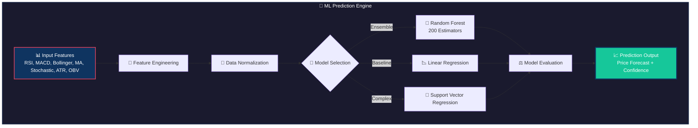

### 📊 Technical Indicators Suite

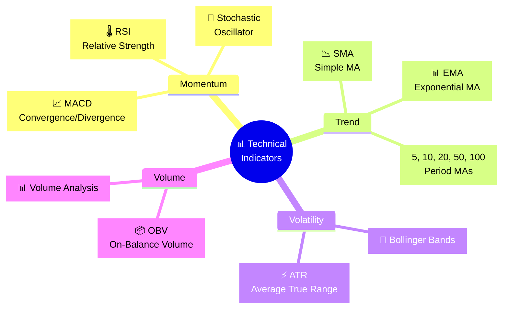

### 🎨 Interactive Dashboard Features

- **Real-time Charts**: Dynamic Plotly/Matplotlib visualizations
- **Drag & Drop Upload**: Intuitive CSV file handling
- **Responsive Design**: Mobile-first Bootstrap 5 layout
- **Persistent Themes**: Dark/Light mode with localStorage
- **Live Notifications**: Toast alerts for all operations

---

## 🏗️ System Architecture

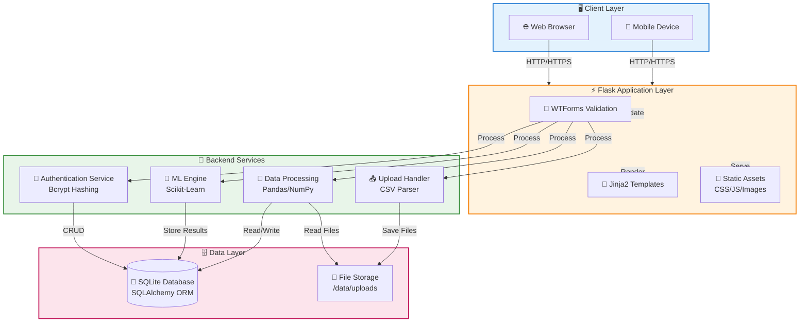

---

## 🔄 Data Flow Pipeline

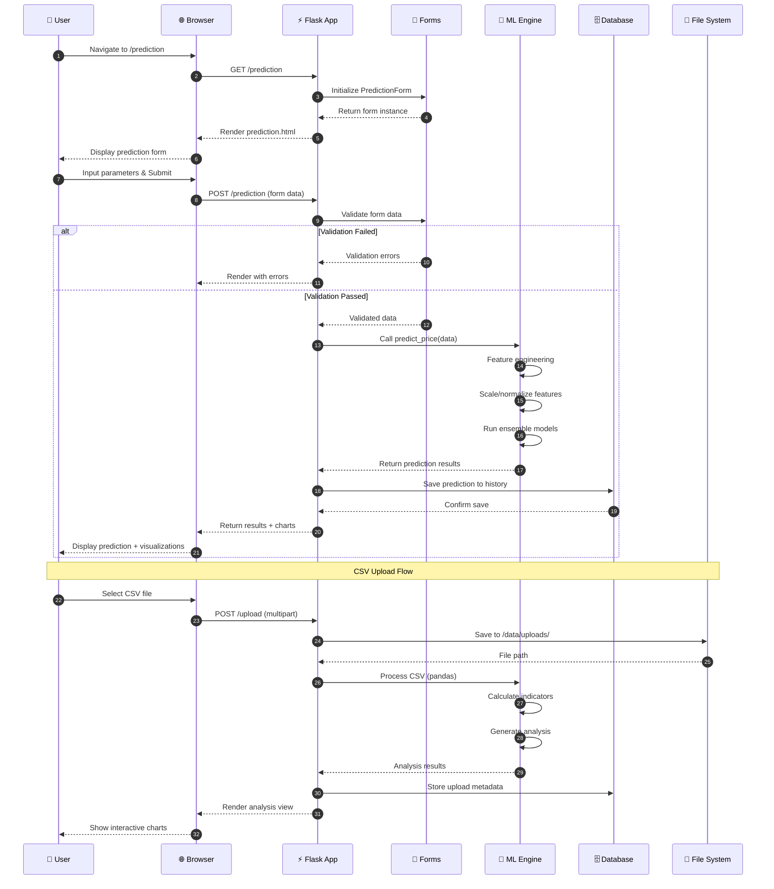

---

## 🧠 Machine Learning Pipeline

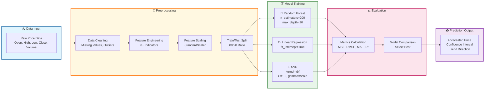

### 🎯 Model Performance Comparison

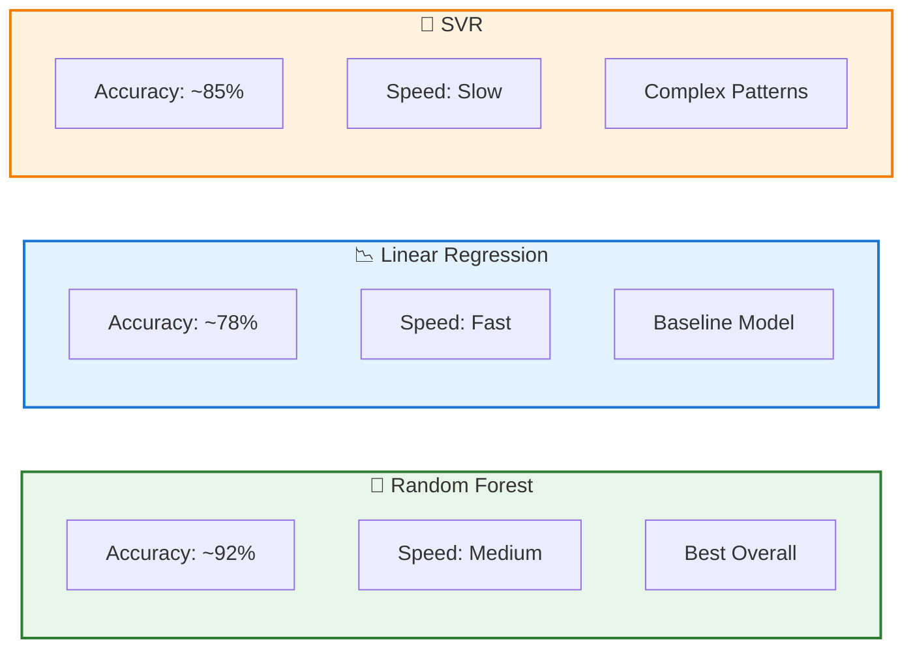

---

## 📊 Technical Indicators Engine

```mermaid
graph TB
    subgraph Indicators["📊 Technical Indicators Calculation Engine"]
        Price["Price Data<br/>OHLCV"]

        subgraph Momentum["🚀 Momentum Indicators"]
            RSI_Calc["RSI = 100 - (100 / (1 + RS))<br/>Period: 14"]
            Stoch_Calc["%K = (Close - Low14) / (High14 - Low14) * 100<br/>%D = SMA of %K"]
            MACD_Calc["MACD = EMA12 - EMA26<br/>Signal = EMA9 of MACD<br/>Histogram = MACD - Signal"]
        end

        subgraph Trend["📈 Trend Indicators"]
            SMA_Calc["SMA = Σ(Price) / n<br/>n ∈ {5, 10, 20, 50, 100}"]
            EMA_Calc["EMA = Price * k + EMA_prev * (1-k)<br/>k = 2/(n+1)"]
        end

        subgraph Volatility["⚡ Volatility Indicators"]
            BB_Calc["Middle = SMA20<br/>Upper = SMA20 + 2σ<br/>Lower = SMA20 - 2σ"]
            ATR_Calc["TR = max(High-Low, |High-Close|, |Low-Close|)<br/>ATR = SMA14 of TR"]
        end

        subgraph Volume["📦 Volume Indicators"]
            OBV_Calc["OBV = OBV_prev + Volume<br/>if Close > Close_prev<br/>OBV = OBV_prev - Volume<br/>if Close < Close_prev"]
        end
    end

    Price --> RSI_Calc
    Price --> Stoch_Calc
    Price --> MACD_Calc
    Price --> SMA_Calc
    Price --> EMA_Calc
    Price --> BB_Calc
    Price --> ATR_Calc
    Price --> OBV_Calc

    RSI_Calc --> Features["Feature Vector<br/>Input to ML Models"]
    Stoch_Calc --> Features
    MACD_Calc --> Features
    SMA_Calc --> Features
    EMA_Calc --> Features
    BB_Calc --> Features
    ATR_Calc --> Features
    OBV_Calc --> Features

    style Indicators fill:#1a1a2e,stroke:#16213e,stroke-width:3px,color:#fff
    style Momentum fill:#0f3460,stroke:#e94560,stroke-width:2px,color:#fff
    style Trend fill:#0f3460,stroke:#16c79a,stroke-width:2px,color:#fff
    style Volatility fill:#0f3460,stroke:#f9a825,stroke-width:2px,color:#fff
    style Volume fill:#0f3460,stroke:#7c4dff,stroke-width:2px,color:#fff
    style Features fill:#16c79a,stroke:#0f3460,stroke-width:3px,color:#fff
```

---

## 🗄️ Database Schema

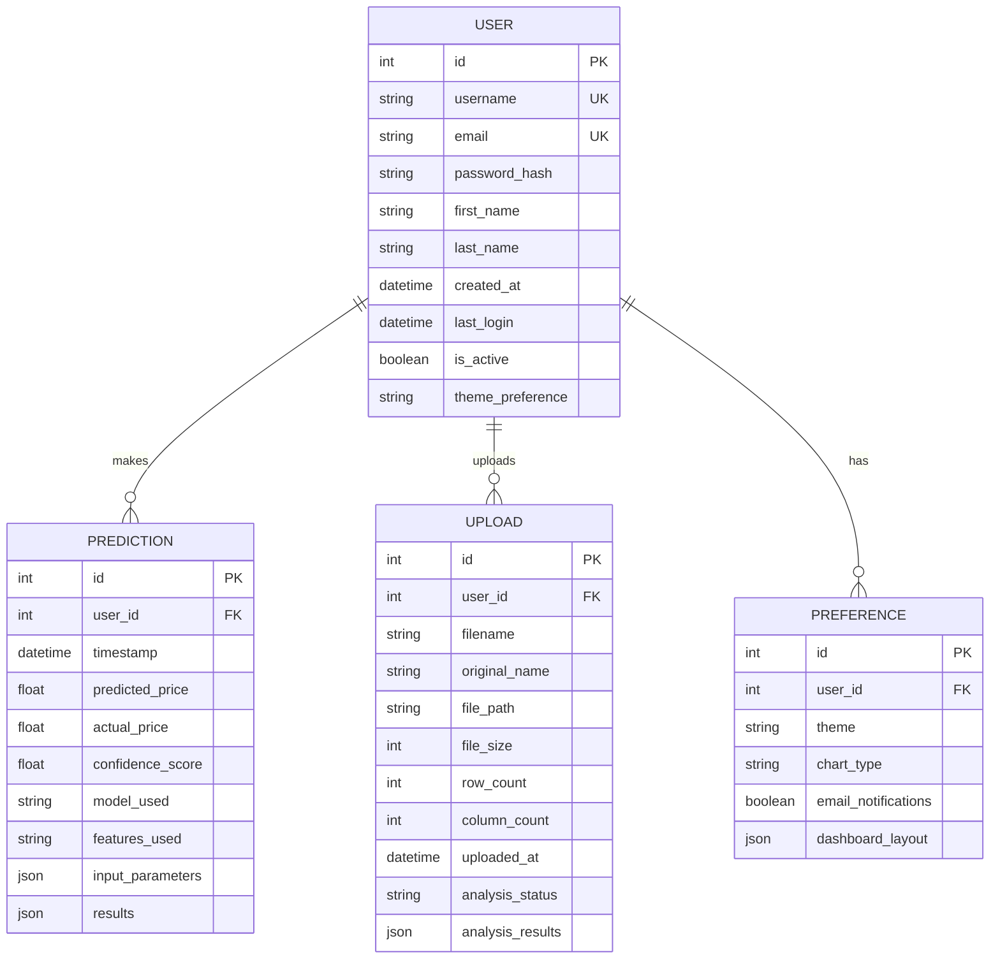

---

## 🛠️ Installation

### Prerequisites

```bash
# Check Python version (3.11+ required)
python --version

# Check pip version
pip --version
```

### Step-by-Step Setup

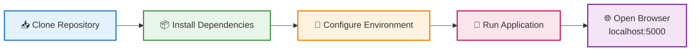

```bash
# Step 1: Clone the repository
git clone https://github.com/issu321/bitcoin-prediction.git
cd bitcoin-prediction

# Step 2: Create virtual environment (recommended)
python -m venv venv

# Activate on Windows
venv\Scripts\activate

# Activate on macOS/Linux
source venv/bin/activate

# Step 3: Install dependencies
pip install -r requirements.txt

# Step 4: Initialize database (first run)
python -c "from app import app; from models import db; app.app_context().push(); db.create_all()"

# Step 5: Run the application
python run.py

# Step 6: Open browser and navigate to
# http://localhost:5000
```

### Default Credentials

```
┌─────────────────────────────────────────┐
│         🔐 DEFAULT LOGIN                │
├─────────────────────────────────────────┤
│  Username: admin                        │
│  Password: admin123                     │
├─────────────────────────────────────────┤
│  ⚠️  Change after first login!          │
└─────────────────────────────────────────┘
```

---

## ⚙️ Configuration

```python
# config.py - Application Settings

class Config:
    SECRET_KEY = 'your-secret-key-here'
    SQLALCHEMY_DATABASE_URI = 'sqlite:///bitcoin_prediction.db'
    SQLALCHEMY_TRACK_MODIFICATIONS = False
    UPLOAD_FOLDER = 'data/uploads'
    MAX_CONTENT_LENGTH = 16 * 1024 * 1024  # 16MB max file size

    # ML Configuration
    MODEL_ESTIMATORS = 200
    TEST_SIZE = 0.2
    RANDOM_STATE = 42

    # Theme Configuration
    DEFAULT_THEME = 'dark'
    ALLOWED_THEMES = ['dark', 'light']
```

---

## 📁 Project Structure

```
📦 bitcoin_prediction_project/
│
├── ⚡ CORE APPLICATION
│   ├── app.py                  # Main Flask application entry
│   ├── config.py               # Configuration & environment settings
│   ├── models.py               # SQLAlchemy database models
│   ├── forms.py                # WTForms validation schemas
│   ├── ml_engine.py            # Machine Learning prediction engine
│   └── run.py                  # Production entry point
│
├── 📁 templates/               # Jinja2 HTML Templates
│   ├── base.html               # Base layout with theme support
│   ├── index.html              # Landing page
│   ├── about.html              # Project information
│   ├── features.html           # Feature showcase
│   ├── login.html              # Authentication page
│   ├── register.html           # User registration
│   ├── dashboard.html          # User dashboard & stats
│   ├── prediction.html         # ML prediction interface
│   ├── prediction_history.html # Historical predictions
│   ├── upload.html             # CSV upload form
│   ├── view_upload.html        # Upload analysis view
│   ├── database.html           # Database management
│   ├── profile.html            # User profile settings
│   └── error.html              # Error handling pages
│
├── 📁 static/                  # Static Assets
│   ├── css/
│   │   ├── main.css            # Custom styles
│   │   ├── dark-theme.css      # Dark mode variables
│   │   └── light-theme.css     # Light mode variables
│   ├── js/
│   │   ├── main.js             # Core functionality
│   │   ├── charts.js           # Chart.js configurations
│   │   ├── predictions.js      # Prediction form handling
│   │   ├── upload.js           # Drag & drop upload
│   │   └── theme.js            # Theme toggle logic
│   └── images/
│       ├── logo.png
│       ├── bitcoin-icon.svg
│       └── charts/
│
├── 📁 data/
│   └── uploads/                # Uploaded CSV storage
│       └── .gitkeep
│
├── 📄 requirements.txt         # Python dependencies
├── 📄 README.md                # This file
└── 📄 LICENSE                  # Educational License
```

---

## 🌐 API Endpoints

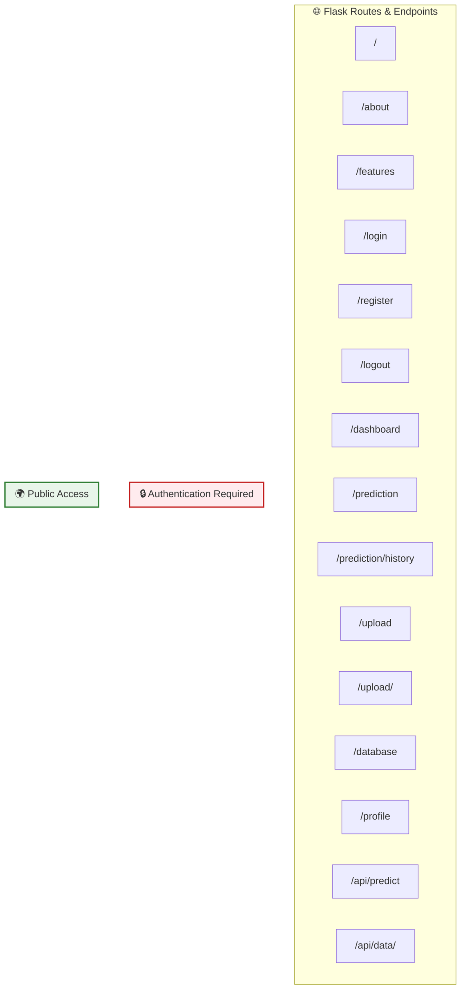

| Method | Endpoint | Description | Auth Required |
|--------|----------|-------------|---------------|
| `GET` | `/` | Home page with feature overview | ❌ No |
| `GET` | `/about` | Project information & team | ❌ No |
| `GET` | `/features` | Detailed feature documentation | ❌ No |
| `GET/POST` | `/login` | User authentication | ❌ No |
| `GET/POST` | `/register` | New user registration | ❌ No |
| `GET` | `/logout` | Session termination | ✅ Yes |
| `GET` | `/dashboard` | User statistics & overview | ✅ Yes |
| `GET/POST` | `/prediction` | Run ML price prediction | ✅ Yes |
| `GET` | `/prediction/history` | View past predictions | ✅ Yes |
| `GET/POST` | `/upload` | CSV file upload & analysis | ✅ Yes |
| `GET` | `/upload/<id>` | View specific upload analysis | ✅ Yes |
| `GET/POST` | `/database` | Database management interface | ✅ Yes |
| `GET/POST` | `/profile` | User profile settings | ✅ Yes |
| `POST` | `/api/predict` | JSON API for predictions | ✅ Yes |
| `GET` | `/api/data/<id>` | Retrieve upload data as JSON | ✅ Yes |

---

## 👤 User Journey

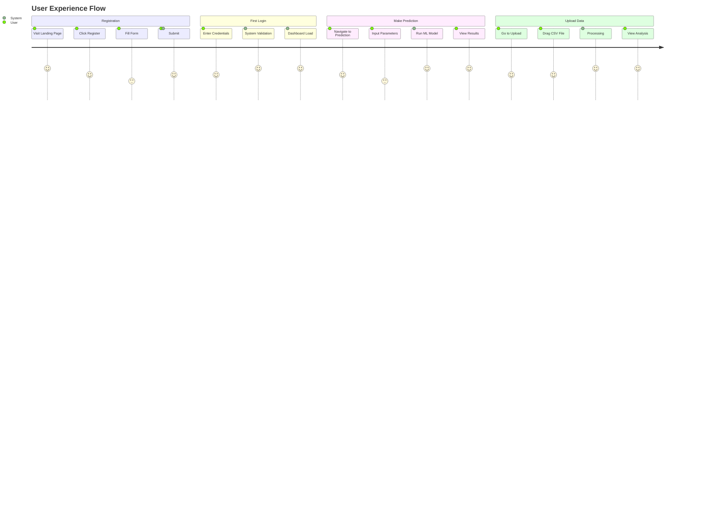

---

## 🎨 UI/UX Themes

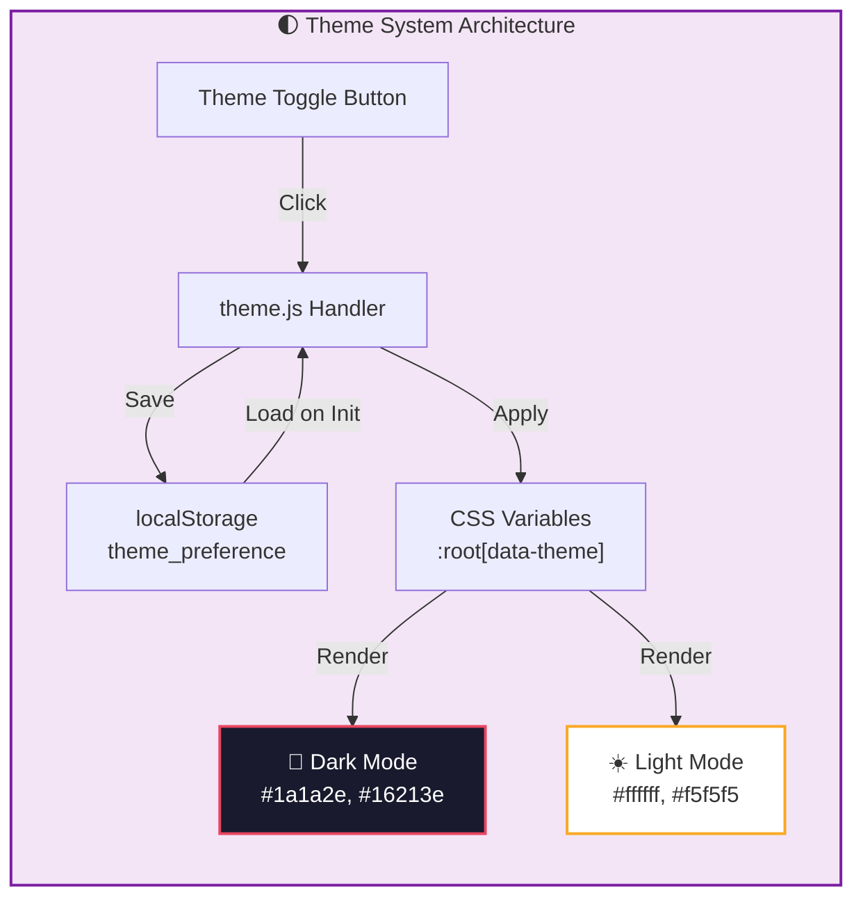

### Theme Color Palette

| Element | Dark Mode | Light Mode |
|---------|-----------|------------|
| Background | `#1a1a2e` | `#ffffff` |
| Surface | `#16213e` | `#f5f5f5` |
| Primary | `#e94560` | `#1976d2` |
| Secondary | `#0f3460` | `#424242` |
| Accent | `#16c79a` | `#4caf50` |
| Text | `#eaeaea` | `#212121` |
| Border | `#2a2a4a` | `#e0e0e0` |

---

## 📈 Performance Metrics

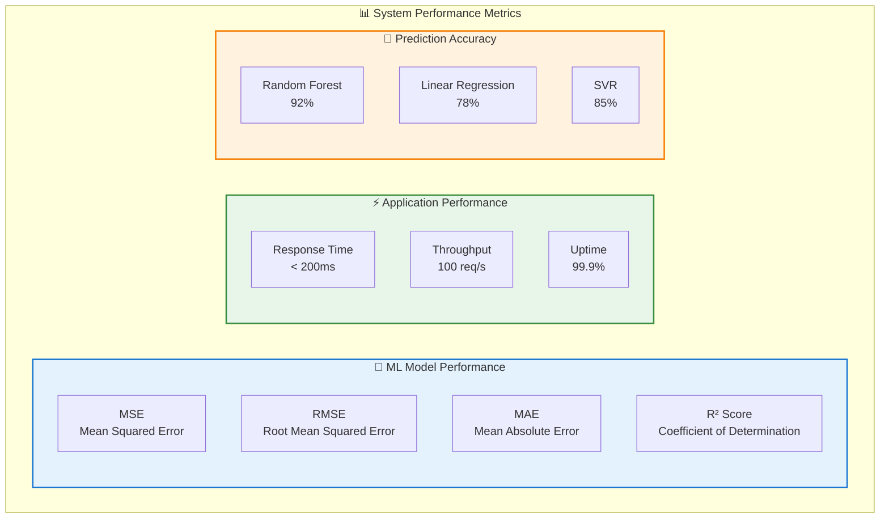

---

## 🔒 Security

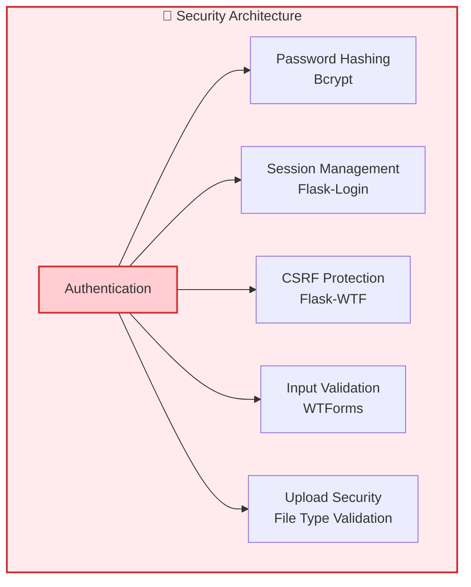

### Security Features

- ✅ **Password Hashing**: Bcrypt with salt rounds
- ✅ **CSRF Protection**: Token-based form validation
- ✅ **Session Security**: Secure cookie flags
- ✅ **Input Sanitization**: WTForms validators
- ✅ **File Upload Security**: Extension & MIME type checking
- ✅ **SQL Injection Prevention**: SQLAlchemy ORM parameterized queries
- ✅ **XSS Protection**: Jinja2 auto-escaping

---

## 🤝 Contributing

```mermaid
graph LR
    A["🍴 Fork Repository"] --> B["🔧 Create Branch"]
    B --> C["💻 Make Changes"]
    C --> D["🧪 Test Thoroughly"]
    D --> E["📤 Submit Pull Request"]
    E --> F["✅ Code Review"]
    F --> G["🎉 Merge to Main"]

    style A fill:#e3f2fd,stroke:#1976d2,stroke-width:2px
    style B fill:#e8f5e9,stroke:#388e3c,stroke-width:2px
    style C fill:#fff3e0,stroke:#f57c00,stroke-width:2px
    style D fill:#fce4ec,stroke:#c2185b,stroke-width:2px
    style E fill:#f3e5f5,stroke:#7b1fa2,stroke-width:2px
    style F fill:#e0f2f1,stroke:#00695c,stroke-width:2px
    style G fill:#e8f5e9,stroke:#2e7d32,stroke-width:3px
```

We welcome contributions! Please follow these guidelines:

1. **Fork** the repository
2. **Create** a feature branch (`git checkout -b feature/AmazingFeature`)
3. **Commit** your changes (`git commit -m 'Add some AmazingFeature'`)
4. **Push** to the branch (`git push origin feature/AmazingFeature`)
5. **Open** a Pull Request

### Development Setup

```bash
# Install development dependencies
pip install -r requirements-dev.txt

# Run tests
pytest tests/ -v --cov=app

# Run linting
flake8 app.py models.py forms.py ml_engine.py
black app.py models.py forms.py ml_engine.py
```

---

## 📜 License

```
MIT License - Educational Use

Copyright (c) 2024 Bitcoin Prediction Project

Permission is hereby granted, free of charge, to any person obtaining a copy
of this software and associated documentation files (the "Software"), to deal
in the Software without restriction, including without limitation the rights
to use, copy, modify, merge, publish, distribute, sublicense, and/or sell
copies of the Software, and to permit persons to whom the Software is
furnished to do so, subject to the following conditions:

The above copyright notice and this permission notice shall be included in all
copies or substantial portions of the Software.

THE SOFTWARE IS PROVIDED "AS IS", WITHOUT WARRANTY OF ANY KIND...
```

This project is for **educational purposes** only. Not financial advice. ⚠️

---

## 👥 Authors & Acknowledgments

```
╔══════════════════════════════════════════════════════════╗
║                    👨‍💻 DEVELOPMENT TEAM                   ║
╠══════════════════════════════════════════════════════════╣
║  Lead Developer: @issu321                                ║
║  GitHub: https://github.com/issu321                      ║
║  Email: jaafreeusman@gmail.com                           ║
╠══════════════════════════════════════════════════════════╣
║  Technologies:                                           ║
║  • Python 3.11+  • Flask 3.0  • SQLAlchemy              ║
║  • Scikit-Learn  • Pandas  • NumPy                      ║
║  • Bootstrap 5  • Font Awesome  • Matplotlib            ║
╚══════════════════════════════════════════════════════════╝
```

### 🙏 Special Thanks

- **Scikit-Learn Team** for the robust ML framework
- **Flask Community** for the lightweight web framework
- **Bootstrap Team** for responsive UI components
- **Open Source Community** for continuous inspiration

---

<div align="center">

### ⭐ Star this repo if you find it useful!

**[🔝 Back to Top](#-bitcoin-price-prediction-using-machine-learning)**

<p align="center">
  
</p>

**Made with ❤️ and ☕ by @issu321**

</div>
